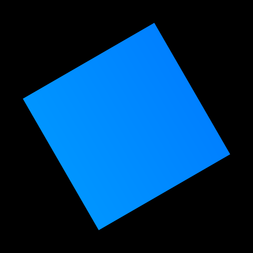

<h1>
   neobox
</h1>

neobox is an experimental, fully open-source alternative to hitbox.io.

## Why?

Hitbox.io has many issues.  
These include bugs, memory leaks, and exploits (see [Hitbox.io Wiki - Glitches](https://hitbox.fandom.com/wiki/Glitches) for an example).  
This results in an unpleasant experience, especially for competitive players in longer sessions.

I believe in open source, and a project such as this is an immensely useful learning exercise.  
It's also a way to fix a game I enjoy.

## Goals / Motivation

For there to be a useful alternative, it needs to be better than the original.  
This is why I have set up some goals that I believe will make the project an improvement over the original.

### Highly Performant

- Even small maps on hitbox.io (with a low number of physics objects) can get very laggy on older systems with more than a couple of players.  
  Improving performance would make playing more accessible to more players.

### Scalable

- Hitbox.io only allows up to 10 players per lobby. This is fine for simpler maps, but for FFA maps, this is inadequate.

### Maintainable

- Chaz, the developer of hitbox.io, has not updated their game in more than a year. The fact that their game is closed-source means that no one else can contribute to the game.  
  This means that a serious bug or vulnerability won't get fixed nearly as fast as one found on an open-source project will.

More will be added later
